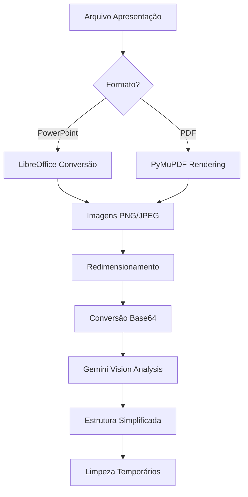

# Atualização do SlideExtractionService - Análise Visual

## Resumo das Mudanças

O `SlideExtractionService` foi completamente refatorado para adotar uma abordagem mais simples e eficaz, focada na **análise visual** dos slides através do Gemini Vision API, ao invés da extração detalhada de elementos estruturais.

## 🎯 Objetivos da Mudança

1. **Simplificação**: Reduzir complexidade da extração de elementos individuais
2. **Análise Visual**: Aproveitar as capacidades do Gemini Vision para análise de imagens
3. **Maior Compatibilidade**: Funcionar melhor com diferentes formatos e layouts
4. **Melhor Qualidade**: Obter insights mais ricos através da análise visual

## 🔧 Principais Alterações

### 1. Nova Estrutura de Dados dos Slides

**Antes (estrutura complexa):**
```python
{
    "slide_number": 1,
    "title": "...",
    "text_content": ["texto1", "texto2"],
    "layout_name": "Title Slide",
    "shapes": [
        {
            "shape_type": "...",
            "left": 0.5,
            "top": 1.0,
            "text": "..."
        }
    ],
    "image_path": "path/to/image.png"
}
```

**Depois (estrutura simplificada):**
```python
{
    "slide_number": 1,
    "image_path": "path/to/image.png",
    "image_base64": "data:image/jpeg;base64,...",
    "layout_name": None,  # Será determinado pelo Gemini
    "extracted_text": None,  # Será extraído pelo Gemini
    "slide_title": None,  # Será determinado pelo Gemini
}
```

### 2. Conversão para Imagens

#### PowerPoint (.pptx/.ppt)
- **Método Principal**: LibreOffice headless para conversão
- **Fallback**: Extração de imagens existentes quando possível
- **Placeholder**: Imagens simples quando conversão falha

#### PDF
- **Método**: PyMuPDF com alta qualidade
- **Configurável**: DPI baseado na configuração de qualidade
- **Otimizado**: Redimensionamento automático para análise

### 3. Configurações de Qualidade

Novas configurações no `settings.py`:

```python
# Gemini Vision
max_image_size_mb: int = 20
image_quality: str = "high"  # high, medium, low
```

**Mapeamento de Qualidade:**
- `high`: 300 DPI, qualidade JPEG 95%
- `medium`: 200 DPI, qualidade JPEG 85%
- `low`: 150 DPI, qualidade JPEG 75%

### 4. Otimizações de Performance

- **Conversão Base64 Imediata**: Imagens convertidas durante extração
- **Redimensionamento Inteligente**: Máximo 1536px para análise eficiente
- **Compressão Adaptativa**: Ajuste automático de qualidade se arquivo muito grande
- **Limpeza Automática**: Remoção de arquivos temporários

## 🔄 Fluxo de Processamento Atualizado



## 🛠️ Dependências

### Obrigatórias
- `python-pptx`: Metadados PowerPoint
- `PyMuPDF` (fitz): Conversão PDF
- `Pillow` (PIL): Processamento de imagens

### Opcionais
- `LibreOffice`: Conversão PowerPoint (recomendado)
  ```bash
  # Ubuntu/Debian
  sudo apt-get install libreoffice
  
  # Alpine (Docker)
  apk add libreoffice
  ```

## 🧪 Testes

Execute o script de teste específico:

```bash
python test_slide_extraction.py
```

### Funcionalidades Testadas
- ✅ Extração de slides PowerPoint e PDF
- ✅ Conversão para imagens
- ✅ Configurações de qualidade
- ✅ Tratamento de erros
- ✅ Limpeza de arquivos temporários
- ✅ Validação de imagens

## 📈 Benefícios da Nova Abordagem

### 1. **Simplicidade**
- Menos código complexo para manutenção
- Estrutura de dados mais limpa
- Fluxo de processamento mais direto

### 2. **Robustez**
- Funciona com qualquer layout ou design
- Não depende de estruturas específicas do PowerPoint
- Melhor tratamento de elementos complexos (gráficos, tabelas, imagens)

### 3. **Qualidade de Análise**
- Gemini Vision pode identificar elementos visuais
- Contextualização melhor entre elementos
- Capacidade de entender design e layout

### 4. **Performance**
- Processamento paralelo de slides
- Conversão otimizada de imagens
- Menor uso de memória

## 🔧 Configuração Recomendada

Para melhor performance e qualidade:

```env
# .env
IMAGE_QUALITY=high
MAX_IMAGE_SIZE_MB=20
TEMP_EXTRACTION_DIRECTORY=./data/temp_extraction
SLIDES_PER_CHUNK=3
```

## 🚀 Próximos Passos

1. **Integração Gemini**: Atualizar `GeminiPresentationService` para usar análise visual
2. **Cache de Imagens**: Implementar cache para evitar reconversões
3. **Batch Processing**: Otimizar processamento em lotes
4. **Métricas**: Adicionar métricas de qualidade de extração

## 📝 Breaking Changes

⚠️ **Atenção**: Esta atualização introduz mudanças que quebram compatibilidade:

1. **Estrutura de dados dos slides alterada**
2. **Métodos `_extract_powerpoint_slide()` e `_extract_pdf_page()` removidos**
3. **Foco em imagens ao invés de texto estruturado**

## 🔄 Migração

Para projetos existentes:

1. Atualizar código que depende da estrutura antiga de slides
2. Verificar se `LibreOffice` está instalado no ambiente
3. Ajustar configurações de qualidade conforme necessário
4. Testar com apresentações específicas do projeto
